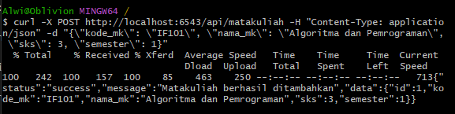
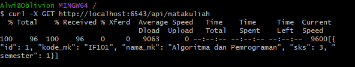
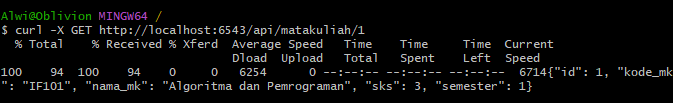
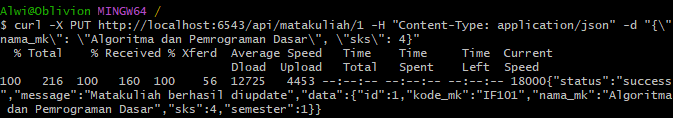
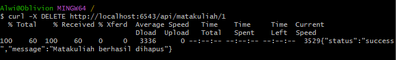

# Aplikasi Manajemen Matakuliah dengan Pyramid Framework

## Deskripsi Proyek

Aplikasi ini merupakan implementasi API RESTful untuk manajemen data matakuliah menggunakan framework Pyramid dan PostgreSQL. Aplikasi memiliki kemampuan CRUD (Create, Read, Update, Delete) untuk pengelolaan data matakuliah yang terdiri dari kode, nama, SKS, dan semester matakuliah.

## Fitur Utama

- Melihat daftar seluruh matakuliah
- Melihat detail matakuliah berdasarkan ID
- Menambahkan matakuliah baru
- Mengubah data matakuliah yang sudah ada
- Menghapus data matakuliah

## Teknologi yang Digunakan

- Python 3.x
- Pyramid Framework
- SQLAlchemy ORM
- PostgreSQL Database
- Alembic (Migrasi Database)

## Struktur Database

Model `Matakuliah` dengan atribut:
- `id`: Primary key
- `kode_mk`: Kode matakuliah (unik)
- `nama_mk`: Nama matakuliah
- `sks`: Jumlah SKS
- `semester`: Semester matakuliah ditawarkan

## Cara Instalasi

1. Clone repository ini
2. Buat virtual environment:
   ```bash
   python -m venv venv
   ```
3. Aktifkan virtual environment:
   - Windows: `venv\Scripts\activate`
   - Linux/Mac: `source venv/bin/activate`
4. Install dependensi:
   ```bash
   pip install -e ".[testing]"
   ```
5. Konfigurasi database di `development.ini`
6. Jalankan migrasi:
   ```bash
   alembic upgrade head
   ```
7. Jalankan aplikasi:
   ```bash
   pserve development.ini --reload
   ```

## Endpoint API

| Endpoint | Method | Deskripsi |
|----------|--------|-----------|
| `/api/matakuliah` | GET | Mendapatkan semua data matakuliah |
| `/api/matakuliah` | POST | Menambahkan matakuliah baru |
| `/api/matakuliah/{id}` | GET | Mendapatkan detail matakuliah berdasarkan ID |
| `/api/matakuliah/{id}` | PUT | Mengubah data matakuliah |
| `/api/matakuliah/{id}` | DELETE | Menghapus data matakuliah |

## Bukti Implementasi

### Database PostgreSQL


*Gambar 1: Skema database PostgreSQL untuk matakuliah*

### Operasi CRUD

#### Create (Menambahkan Matakuliah)

*Gambar 2: Menambahkan matakuliah baru melalui API*

#### Read (Membaca Data Matakuliah)

*Gambar 3: Mengambil data matakuliah melalui API*

#### Read (Membaca Data Matakuliah)

*Gambar 4: Mengambil data matakuliah melalui API*

#### Update (Mengubah Data Matakuliah)

*Gambar 5: Mengubah data matakuliah melalui API*

#### Delete (Menghapus Matakuliah)

*Gambar 6: Menghapus data matakuliah melalui API*

## Kontributor

- [Alwi Arfan Solin] (122140197)

## Lisensi

Proyek ini adalah tugas praktikum untuk mata kuliah Pemrograman Web.